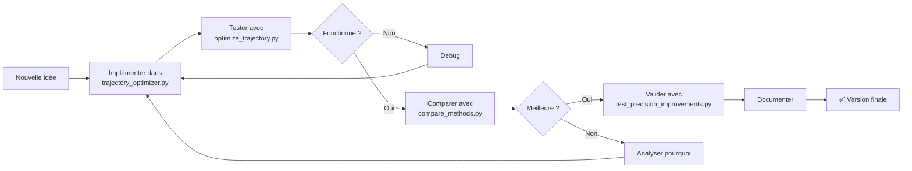

# 🔄 Workflow du Système d'Optimisation de Trajectoire

## 📋 Vue d'ensemble

Ce document décrit les différents workflows possibles pour utiliser le système d'optimisation de trajectoire ENAC. Chaque workflow est illustré avec des exemples concrets et des commandes.

---

## 🎯 Workflow Principal : Optimisation de Trajectoire

### 1️⃣ **Workflow Simple : Optimiser une trajectoire**

```
Fichier KML → Parser → Optimiser → Visualiser
```

**Étapes :**

```python
# 1. Charger les données
from src.data.kml_parser import KMLParser
parser = KMLParser('data/sample/F-HZUE-track-EGM96.kml')
trajectory = parser.parse()

# 2. Optimiser (méthode au choix)
from src.optimization.trajectory_optimizer import TrajectoryOptimizer
optimizer = TrajectoryOptimizer()

# Choisir une méthode :
optimized = optimizer.optimize_kalman(trajectory)          # Filtre Kalman
# ou
optimized = optimizer.optimize_bspline(trajectory)         # B-Spline
# ou
optimized = optimizer.optimize_hybrid(trajectory)          # Hybride (recommandé)
# ou
optimized = optimizer.optimize_weather_aware(trajectory)   # Météo
# ou
optimized = optimizer.optimize_nlp(trajectory)             # NLP (plus précis)

# 3. Visualiser
from src.utils.visualization import TrajectoryVisualizer
viz = TrajectoryVisualizer()
viz.plot_comparison(trajectory, optimized, output_file='output/result.html')
```

**Script prêt à l'emploi :**
```bash
cd examples
python optimize_trajectory.py
```

---

### 2️⃣ **Workflow Comparatif : Tester toutes les méthodes**

```
Données → 5 Méthodes en parallèle → Comparaison → Meilleure méthode
```

**Étapes :**

```python
from src.optimization.trajectory_optimizer import TrajectoryOptimizer
from src.data.kml_parser import KMLParser

# Charger
parser = KMLParser('data/sample/4B1804-track-EGM96.kml')
trajectory = parser.parse()

# Optimiser avec toutes les méthodes
optimizer = TrajectoryOptimizer()
results = {
    'kalman': optimizer.optimize_kalman(trajectory),
    'bspline': optimizer.optimize_bspline(trajectory),
    'hybrid': optimizer.optimize_hybrid(trajectory),
    'weather': optimizer.optimize_weather_aware(trajectory),
    'nlp': optimizer.optimize_nlp(trajectory)
}

# Comparer
from src.utils.visualization import TrajectoryVisualizer
viz = TrajectoryVisualizer()
viz.plot_methods_comparison(trajectory, results, 'output/comparison.html')
```

**Scripts prêts à l'emploi :**
```bash
cd examples
python compare_methods.py              # Comparaison simple
python compare_methods_parallel.py     # Plus rapide (parallèle)
python run_all_comparisons.py          # Tous les fichiers KML
```

---

### 3️⃣ **Workflow Dashboard : Interface Web Interactive**

```
Streamlit Dashboard → Charger KML → Choisir méthode → Résultats en temps réel
```

**Lancement :**

```bash
cd examples
streamlit run dashboard_improved.py
```

**Puis dans le navigateur :**
1. 📂 Uploader un fichier KML
2. ⚙️ Choisir méthode d'optimisation
3. 🎛️ Ajuster les paramètres
4. ▶️ Lancer l'optimisation
5. 📊 Visualiser résultats interactifs

**Fonctionnalités du Dashboard :**
- Carte interactive avec trajectoires
- Graphiques de métriques (altitude, vitesse, erreurs)
- Comparaison côte-à-côte
- Export des résultats
- Détection de spoofing intégrée

---

## 🛡️ Workflow Sécurité : Détection de Spoofing GPS/ADS-B

### 4️⃣ **Workflow Détection Basique**

```
Trajectoire → Détecteur Basique → Rapport d'anomalies
```

**Étapes :**

```python
from src.data.kml_parser import KMLParser
from src.security.spoofing_detector import SpoofingDetector

# Charger
parser = KMLParser('data/sample/9H-WAK-track-EGM96.kml')
trajectory = parser.parse()

# Détecter
detector = SpoofingDetector(commercial_aircraft=True)
anomalies = detector.detect_anomalies(trajectory)

# Rapport
summary = detector.get_summary(anomalies)
print(f"Anomalies détectées : {summary['total_anomalies']}")
print(f"Types : {summary['types']}")

# Visualiser
detector.plot_anomalies(trajectory, anomalies, 'output/anomalies.html')
```

---

### 5️⃣ **Workflow Détection Avancée (ML + Patterns)**

```
Trajectoire → Détecteur Avancé → Analyse multi-couches → Rapport complet
```

**Étapes :**

```python
from src.data.kml_parser import KMLParser
from src.security.advanced_spoofing_detector import AdvancedSpoofingDetector

# Charger
parser = KMLParser('data/sample/EI-IHR-track-EGM96.kml')
trajectory = parser.parse()

# Analyser avec détecteur avancé
detector = AdvancedSpoofingDetector(
    commercial_aircraft=True,
    enable_ml_scoring=True,
    enable_pattern_detection=True
)

# Analyse complète
report = detector.analyze_comprehensive(trajectory, verbose=True)

# Résultats
print(f"Score de risque : {report.global_risk_score*100:.1f}%")
print(f"Anomalies : {len(report.anomalies)}")
print(f"Patterns détectés : {report.detected_patterns}")
print(f"Replay attack : {report.replay_attack_detected}")
print(f"Recommandations : {report.recommendations}")
```

**Script prêt à l'emploi :**
```bash
cd examples
python example_advanced_spoofing.py
```

**Analyse en 6 couches :**
1. 🔍 Règles physiques (10 types d'anomalies)
2. 📊 Outliers statistiques (multivarié)
3. 🎯 Patterns de spoofing (7 signatures connues)
4. 🌍 Cohérence globale (continuité + plausibilité)
5. 🔄 Replay attack (segments répétés)
6. 🤖 Score ML (risque 0.0-1.0)

---

### 6️⃣ **Workflow Test de Détection : Injecter du Spoofing**

```
Trajectoire propre → Injecter spoofing → Détecter → Valider efficacité
```

**Étapes :**

```python
from src.data.kml_parser import KMLParser
from src.security.spoofing_injector import SpoofingInjector, SpoofingConfig, SpoofingType
from src.security.advanced_spoofing_detector import AdvancedSpoofingDetector

# 1. Charger trajectoire propre
parser = KMLParser('data/sample/F-HZUE-track-EGM96.kml')
clean_trajectory = parser.parse()

# 2. Injecter spoofing
injector = SpoofingInjector(seed=42)

# Téléportation (sauts de position)
config1 = SpoofingConfig(
    spoofing_type=SpoofingType.TELEPORTATION,
    num_points=3,
    intensity=5.0
)
spoofed = injector.inject(clean_trajectory, config1)

# Vitesses impossibles
config2 = SpoofingConfig(
    spoofing_type=SpoofingType.SPEED_MANIPULATION,
    num_points=2,
    intensity=2.0
)
spoofed = injector.inject(spoofed, config2)

# 3. Détecter
detector = AdvancedSpoofingDetector()
report = detector.analyze_comprehensive(spoofed)

# 4. Valider
print(f"Spoofing détecté : {report.global_risk_score > 0.5}")
print(f"Score : {report.global_risk_score*100:.1f}%")
```

**Types de spoofing injectables :**
- `TELEPORTATION` : Sauts de position
- `SPEED_MANIPULATION` : Vitesses irréalistes
- `ALTITUDE_JUMP` : Changements brutaux d'altitude
- `TIME_WARP` : Timestamps incohérents
- `GHOST_AIRCRAFT` : Positions fictives
- `POSITION_DRIFT` : Dérive progressive
- `ALTITUDE_INVERSION` : Inversions altitude
- `IMPOSSIBLE_MANEUVER` : Manœuvres impossibles

---

## 📊 Workflow Validation : Tests de Précision

### 7️⃣ **Workflow Test des Améliorations**

```
Anciennes méthodes vs Nouvelles → Comparaison métriques → Validation gains
```

**Lancement :**

```bash
cd examples
python test_precision_improvements.py
```

**Tests effectués :**
1. ✅ Kalman avec/sans bruit altitude-dépendant
2. ✅ B-Spline avec/sans auto-smoothing
3. ✅ NLP avec/sans convergence stricte
4. ✅ Comparaison globale toutes méthodes

**Métriques mesurées :**
- Erreur moyenne (m)
- Erreur max (m)
- Temps de calcul (s)
- Lissage de trajectoire

---

## 🎨 Workflow Visualisation Avancée

### 8️⃣ **Workflow Cartes Interactives**

```
Trajectoire(s) → Carte Folium → Tooltips + Clusters → HTML interactif
```

**Étapes :**

```python
from src.data.kml_parser import KMLParser
from src.utils.visualization import TrajectoryVisualizer

# Charger plusieurs trajectoires
trajectories = []
for kml_file in ['data/sample/4B1804-track-EGM96.kml', 
                 'data/sample/9H-WAK-track-EGM96.kml']:
    parser = KMLParser(kml_file)
    trajectories.append(parser.parse())

# Visualiser
viz = TrajectoryVisualizer()
viz.plot_multiple_trajectories(
    trajectories,
    output_file='output/multi_trajectories.html',
    show_markers=True,
    show_heatmap=True
)
```

---

### 9️⃣ **Workflow Graphiques de Métriques**

```
Trajectoire → Extraire métriques → Graphiques Plotly → Dashboard HTML
```

**Étapes :**

```python
from src.data.kml_parser import KMLParser
from src.utils.visualization import TrajectoryVisualizer

parser = KMLParser('data/sample/F-HZUE-track-EGM96.kml')
trajectory = parser.parse()

viz = TrajectoryVisualizer()

# Graphique altitude
viz.plot_altitude_profile(trajectory, 'output/altitude.html')

# Graphique vitesse
viz.plot_speed_profile(trajectory, 'output/speed.html')

# Graphique 3D
viz.plot_3d_trajectory(trajectory, 'output/3d.html')

# Heatmap
viz.plot_heatmap(trajectory, 'output/heatmap.html')
```

---

## 🔧 Workflow Personnalisé : API Météo

### 🔟 **Workflow Optimisation avec Données Météo**

```
Trajectoire → API Météo → Vents en altitude → Optimisation weather-aware → Économie carburant
```

**Étapes :**

```python
from src.data.kml_parser import KMLParser
from src.optimization.trajectory_optimizer import TrajectoryOptimizer
from src.weather.weather_api import WeatherAPI

# Charger
parser = KMLParser('data/sample/4B1804-track-EGM96.kml')
trajectory = parser.parse()

# Optimiser avec météo
optimizer = TrajectoryOptimizer()
optimized = optimizer.optimize_weather_aware(
    trajectory,
    wind_factor=0.8  # Poids des vents dans optimisation
)

# Analyser gains
print(f"Distance économisée : {optimizer.distance_saved} km")
print(f"Temps économisé : {optimizer.time_saved} min")
print(f"Carburant économisé (estimé) : {optimizer.fuel_saved} kg")
```

**Note :** Nécessite une clé API OpenWeatherMap (gratuite pour usage limité)

---

## ✂️ Optimisation Partielle — Choisir un Point de Départ

Utile pour préserver les phases critiques (décollage, approche) et n'optimiser que la croisière.

### Par temps écoulé

```python
optimizer = TrajectoryOptimizer(method=OptimizationMethod.HYBRID)
result = optimizer.optimize(trajectory, target_points=100, start_time=600)  # après 10 min
```

### Par distance parcourue

```python
result = optimizer.optimize(trajectory, target_points=100, start_distance=50000)  # après 50 km
```

### Recommandations pour un vol commercial

| Phase | Paramètre suggéré | Action |
|-------|-------------------|--------|
| Décollage + montée (0–10 min) | — | **Préserver** (trajectoire ATC) |
| Croisière (10–50 min) | `start_time=600` | **Optimiser** (maximum d'économie) |
| Descente + approche | `start_time=<fin croisière>` | **Optimiser légèrement** |

Utiliser `start_time` pour les analyses temporelles, `start_distance` pour les analyses géographiques (zones ATC).

**Script d'exemple** :
```bash
python examples/example_partial_optimization.py
```

---

## 📁 Structure des Fichiers de Sortie

### **Outputs générés par le système :**

```
output/
├── trajectory_map.html              # Carte interactive simple
├── methods_comparison_map.html      # Comparaison des méthodes
├── partial_optimization/            # Optimisations partielles
│   └── partial_optimization_map.html
├── scenario_light.html              # Test léger
├── scenario_medium.html             # Test moyen
├── scenario_heavy.html              # Test lourd
├── injection_personnalisee.html     # Spoofing injecté
└── exemple_1_leger.html             # Exemple rapide
```

---

## 🚀 Workflows Rapides (Copy-Paste)

### **A. Optimisation rapide d'un vol**
```bash
cd examples
python -c "
from src.data.kml_parser import KMLParser
from src.optimization.trajectory_optimizer import TrajectoryOptimizer
from src.utils.visualization import TrajectoryVisualizer

parser = KMLParser('../data/sample/F-HZUE-track-EGM96.kml')
traj = parser.parse()

opt = TrajectoryOptimizer()
result = opt.optimize_hybrid(traj)

viz = TrajectoryVisualizer()
viz.plot_comparison(traj, result, '../output/quick_result.html')
print('✅ Résultat : output/quick_result.html')
"
```

### **B. Détection spoofing rapide**
```bash
cd examples
python test_spoofing_quick.py
```

### **C. Comparaison toutes méthodes**
```bash
cd examples
python run_all_comparisons.py
```

### **D. Dashboard interactif**
```bash
cd examples
streamlit run dashboard_improved.py
```

---

## 📊 Tableau Récapitulatif des Scripts

| Script | Fonction | Temps | Sortie |
|--------|----------|-------|--------|
| `optimize_trajectory.py` | Optimisation simple | ~5s | HTML carte |
| `compare_methods.py` | Compare 5 méthodes | ~30s | HTML + métriques |
| `compare_methods_parallel.py` | Idem parallèle | ~15s | HTML + métriques |
| `run_all_comparisons.py` | Tous fichiers KML | ~2min | Dossier complet |
| `dashboard_improved.py` | Interface web | - | App Streamlit |
| `example_advanced_spoofing.py` | Test détection | ~20s | Terminal + rapport |
| `test_precision_improvements.py` | Validation gains | ~40s | Terminal + métriques |
| `visualiser_spoofing.py` | Visualisation anomalies | ~10s | HTML carte |
| `example_partial_optimization.py` | Optimisation partielle | ~8s | HTML carte |

---

## 🎯 Cas d'Usage Typiques

### **Cas 1 : Analyste voulant optimiser UN vol**
```
1. dashboard_improved.py
2. Uploader KML
3. Choisir méthode
4. Visualiser
```

### **Cas 2 : Chercheur comparant méthodes**
```
1. compare_methods_parallel.py
2. Analyser métriques
3. Publication résultats
```

### **Cas 3 : Ingénieur sécurité**
```
1. example_advanced_spoofing.py
2. Vérifier score de risque
3. Investiguer anomalies
```

### **Cas 4 : Développeur ajoutant nouvelle méthode**
```
1. Modifier trajectory_optimizer.py
2. Ajouter méthode optimize_XXX()
3. Tester avec compare_methods.py
4. Valider avec test_precision_improvements.py
```

---

## 🔄 Workflow de Développement

### **Cycle complet de développement**



---

## 📖 Ressources et Documentation

### **Documentation Détaillée**

- [README.md](README.md) : Vue d'ensemble du projet
- [METHODES_OPTIMISATION.md](METHODES_OPTIMISATION.md) : Analyse et comparaison des méthodes
- [CHANGELOG_2026.md](CHANGELOG_2026.md) : Corrections et améliorations 2026
- [SPOOFING.md](SPOOFING.md) : Détection de spoofing GPS/ADS-B

### **Code Source**

```
src/
├── data/              # Parsing et modèles
├── filters/           # Filtre de Kalman
├── optimization/      # 5 méthodes d'optimisation
├── security/          # Détection de spoofing
├── utils/             # Visualisation
└── weather/           # API météo
```

### **Exemples**

```
examples/
├── optimize_trajectory.py          # Exemple simple
├── compare_methods*.py             # Comparaisons
├── dashboard*.py                   # Interfaces web
├── example_*_spoofing.py          # Tests sécurité
├── test_*.py                      # Validations
└── visualiser_spoofing.py         # Visualisations
```

---

## 🎓 Tutoriels Étape par Étape

### **Tutoriel 1 : Première optimisation (5 min)**

```bash
# 1. Installer dépendances
pip install -r requirements.txt

# 2. Se placer dans examples
cd examples

# 3. Optimiser un vol
python optimize_trajectory.py

# 4. Ouvrir le résultat
# Fichier : output/trajectory_map.html
```

### **Tutoriel 2 : Comparer toutes les méthodes (10 min)**

```bash
# 1. Lancer comparaison
python compare_methods_parallel.py

# 2. Analyser les résultats
# Terminal affiche métriques
# output/methods_comparison_map.html pour carte

# 3. Choisir la meilleure méthode
# Généralement : Hybrid ou NLP
```

### **Tutoriel 3 : Détecter du spoofing (8 min)**

```bash
# 1. Tester le détecteur avancé
python example_advanced_spoofing.py

# 2. Observer les 5 tests
# Test 1 : Trajectoire propre
# Test 2 : Spoofing injecté
# Test 3 : Patterns spécifiques
# Test 4 : Comparaison basique/avancé
# Test 5 : Replay attack

# 3. Analyser le score de risque
# < 0.2 → Sûr
# 0.2-0.5 → Vérification
# > 0.5 → Risque élevé
```

---

## ⚡ Best Practices

### **Performances**

1. **Utiliser la version parallèle** pour plusieurs fichiers
   ```bash
   python compare_methods_parallel.py  # 2× plus rapide
   ```

2. **Sous-échantillonner** les très longues trajectoires
   ```python
   trajectory = trajectory.subsample(max_points=1000)
   ```

3. **Désactiver verbose** en production
   ```python
   detector.analyze_comprehensive(traj, verbose=False)
   ```

### **Précision**

1. **Utiliser NLP** pour précision maximale
   ```python
   optimized = optimizer.optimize_nlp(trajectory)
   ```

2. **Hybrid** pour bon compromis vitesse/précision
   ```python
   optimized = optimizer.optimize_hybrid(trajectory)
   ```

3. **Tester les paramètres** avec dashboard
   - Ajuster smoothing B-spline
   - Modifier seuils Kalman
   - Tweaker convergence NLP

### **Sécurité**

1. **Toujours valider** avec détecteur avancé
   ```python
   report = AdvancedSpoofingDetector().analyze_comprehensive(traj)
   if report.global_risk_score > 0.5:
       print("⚠️ SUSPICION DE SPOOFING")
   ```

2. **Croiser sources** pour vols critiques
   - ADS-B + Radar + ATC
   - Vérifier cohérence

3. **Logger anomalies** pour analyse ultérieure
   ```python
   with open('security_log.json', 'w') as f:
       json.dump(report.to_dict(), f)
   ```

---

## 🆘 Dépannage

### **Problème : "No module named 'src'"**
```bash
# Vérifier que vous êtes dans examples/
cd examples
python script.py
```

### **Problème : "KML file not found"**
```bash
# Vérifier chemins relatifs
# Dans examples/, utiliser ../data/sample/
parser = KMLParser('../data/sample/fichier.kml')
```

### **Problème : Dashboard Streamlit ne démarre pas**
```bash
# Réinstaller Streamlit
pip install --upgrade streamlit

# Lancer avec port spécifique
streamlit run dashboard_improved.py --server.port 8502
```

### **Problème : Optimisation NLP trop lente**
```bash
# Réduire nombre de points
trajectory = trajectory.subsample(max_points=500)

# Ou utiliser méthode plus rapide
optimized = optimizer.optimize_hybrid(trajectory)
```

---

*Document créé le 10/02/2026 - ENAC Projet Technique*  
*Système d'Optimisation de Trajectoire v2.0*
